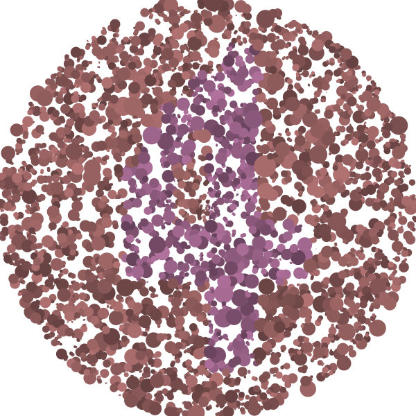

# ishihara test generator

This will generate an ishihara test svg file.

 * It generates a set of random circles of varying sizes and colors.
 * It chooses between two base colors (in HSV) based on a mask
 * It varies the Value of the colors independent of the base color

The generated SVG will then be able to tell if you can differentiate
the two base colors apart.

The following image was generated by this script, and it points at two
colors that only colorblind people seem to be able to
differentiate. If you are colorblind you should see a number 4.

